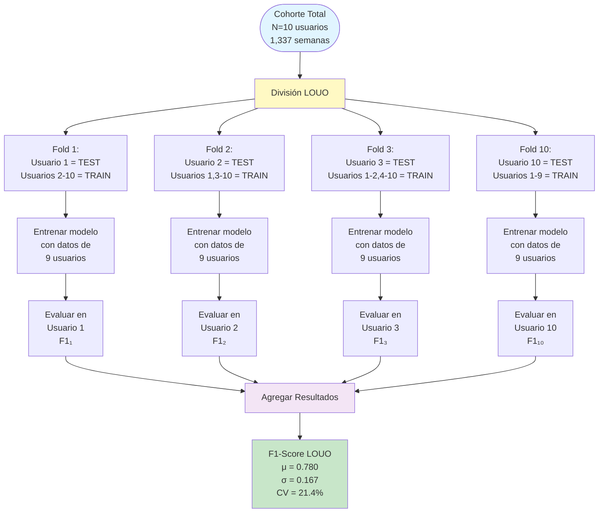
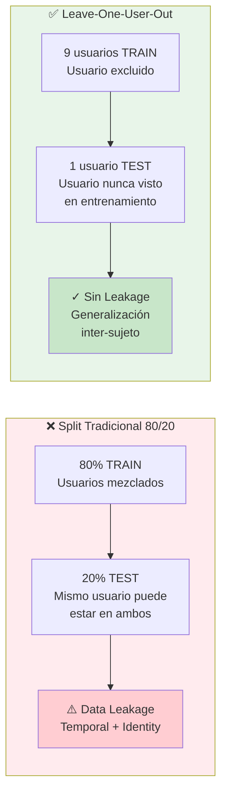
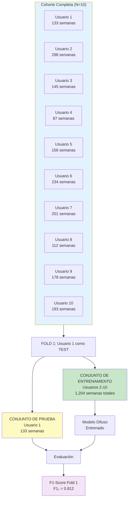
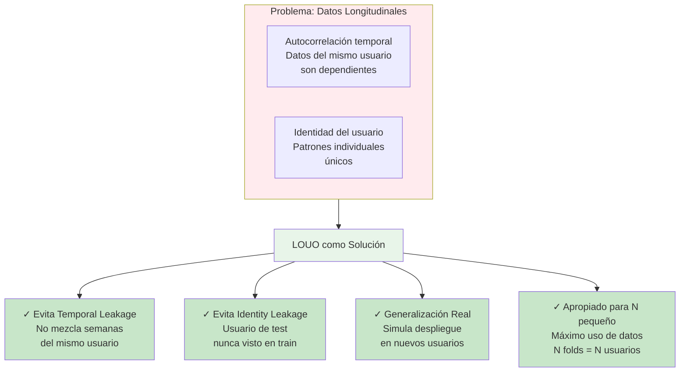
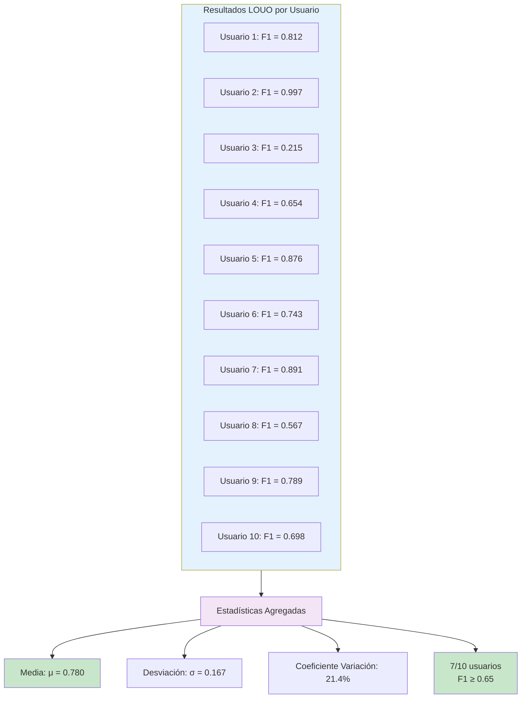
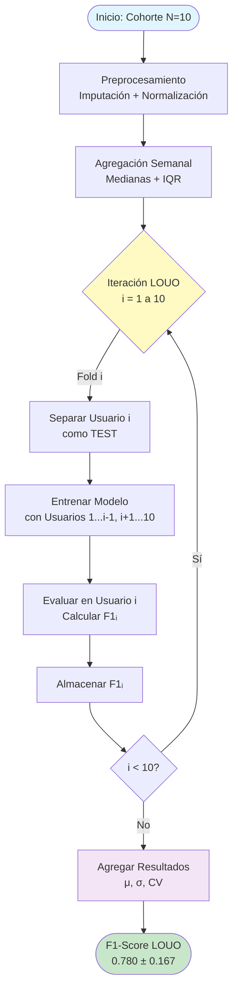
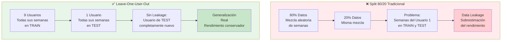

# DIAGRAMA EXPLICATIVO: LEAVE-ONE-USER-OUT (LOUO)

## Diagrama 1: Proceso General de LOUO

## Diagrama 2: Comparación LOUO vs Split Tradicional

## Diagrama 3: Ejemplo Iterativo Detallado (Fold 1)

## Diagrama 4: Ventajas de LOUO para Datos Longitudinales

## Diagrama 5: Resultados por Usuario (Visualización)

## Diagrama 6: Flujo Completo del Proceso

## Diagrama 7: Comparación Visual: Split 80/20 vs LOUO

---

## INSTRUCCIONES DE USO

### Para PowerPoint/Google Slides:
1. Copia el código Mermaid del diagrama que prefieras
2. Ve a [Mermaid Live Editor](https://mermaid.live/)
3. Pega el código y genera la imagen
4. Exporta como PNG/SVG de alta resolución
5. Inserta en tu presentación

### Para LaTeX (si necesitas en la tesis):
Los diagramas Mermaid se pueden convertir a TikZ o usar el paquete `mermaid` si está disponible.

### Recomendación para Presentación:
- **Diapositiva 10 (Metodología):** Usa el Diagrama 1 o Diagrama 6
- **Diapositiva 11 (Resultados):** Usa el Diagrama 5
- **Si hay preguntas sobre validación:** Usa el Diagrama 2 o Diagrama 7

---

## EXPLICACIÓN TEXTUAL PARA EL GUION

**Para Diagrama 1 (Proceso General):**
> "La validación Leave-One-User-Out divide nuestra cohorte de 10 usuarios en 10 iteraciones. En cada iteración, un usuario se excluye completamente del entrenamiento y se usa exclusivamente para evaluación. El modelo se entrena con los datos de los 9 usuarios restantes, y luego se evalúa en el usuario excluido. Este proceso se repite para cada usuario, generando 10 valores de F1-Score que se agregan para obtener nuestra métrica final de 0.780 con desviación estándar de 0.167."

**Para Diagrama 2 (Comparación):**
> "A diferencia del split tradicional 80/20, donde los datos se mezclan aleatoriamente y el mismo usuario puede aparecer en entrenamiento y prueba, LOUO garantiza que el usuario de prueba nunca ha sido visto durante el entrenamiento. Esto elimina completamente el data leakage temporal e identitario, proporcionando una estimación realista de la generalización inter-sujeto."

---

**Nota:** Estos diagramas están optimizados para explicar LOUO de manera clara y visual. Elige el que mejor se adapte a tu estilo de presentación.

