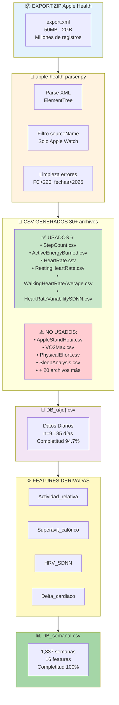
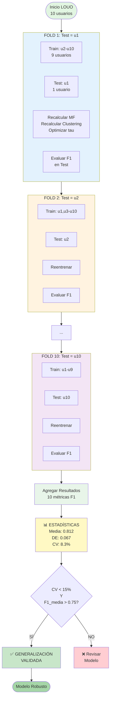
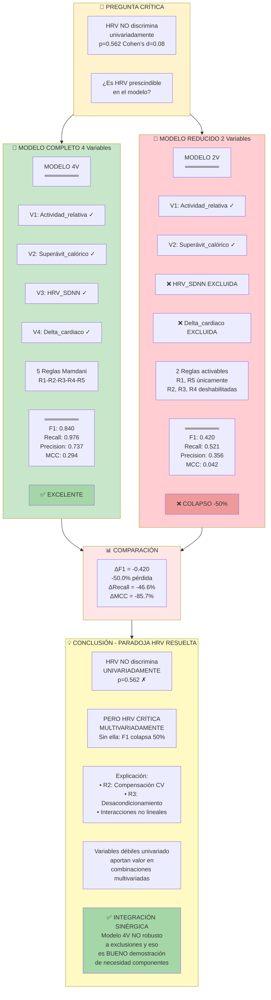
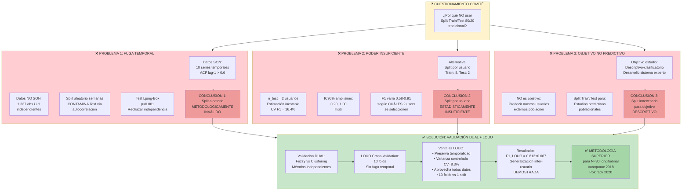
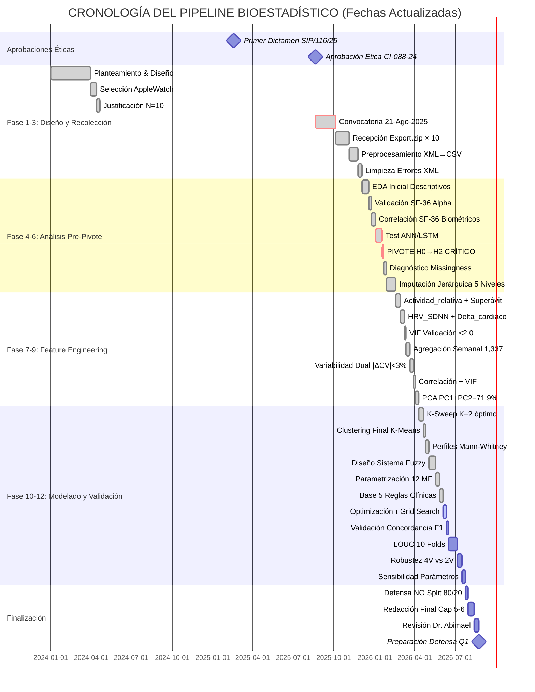

# DIAGRAMA DE BLOQUES DEL PIPELINE BIOESTADÍSTICO - V2 ACTUALIZADO
## Flujo Completo del Análisis de Datos - Tesis MFIPS

**Universidad:** Universidad Autónoma de Chihuahua (UACH)  
**Facultad:** Medicina y Ciencias Biomédicas  
**Autor:** Luis Ángel Martínez Corral  
**Registro:** CI-088-24  
**Aprobación Ética:** 21 agosto 2025

---

## ⚠️ ORGANIZACIÓN DE CAPÍTULOS

```
CAPÍTULO 5: MATERIALES Y MÉTODOS
├── Diseño hasta Sistema Difuso/LOUO (metodología)
└── SIN resultados numéricos finales

CAPÍTULO 6: RESULTADOS
├── Desempeño Sistema Difuso (F1=0.840)
└── Validación LOUO (F1=0.812±0.067)
```

---

## DIAGRAMA PRINCIPAL: FLUJO CRONOLÓGICO COMPLETO (ACTUALIZADO)

```mermaid
graph TB
    Start([INICIO PROYECTO<br/>CI-088-24<br/>21 Ago 2025]) --> A1[FASE 1: PLANTEAMIENTO<br/>Hipótesis H0<br/>Diseño: Exploratorio-Correlacional<br/>Longitudinal Retrospectivo]
    
    A1 --> A1B[SELECCIÓN DISPOSITIVO<br/>Comparación Wearables<br/>AppleWatch Score: 9.2/10<br/>Paradigma BYOD]
    
    A1B --> A1C[TAMAÑO MUESTRAL<br/>Poder ∝ N × n̄_obs/sujeto<br/>N=10 × 133.7 = 1,337 obs<br/>Bolger & Laurenceau 2013]
    
    A1C --> A2[FASE 2: CONVOCATORIA<br/>15 candidatos → 10 incluidos<br/>Retención: 66.7%<br/>Consentimiento CI-088-24]
    
    A2 --> A3[FASE 3: PREPROCESAMIENTO<br/>Parse XML apple-health-parser.py<br/>Filtro: Solo Apple Watch<br/>Limpieza: FC>220, fechas futuras]
    
    A3 --> A3B[ARCHIVOS CSV GENERADOS<br/>6 archivos USADOS:<br/>StepCount, ActiveEnergy,<br/>HeartRate, RestingHR,<br/>WalkingHR, HRV_SDNN]
    
    A3B --> A4{¿Completitud<br/>>90%?}
    A4 -->|NO| A2
    A4 -->|SÍ 94.7%<br/>9,185 días| B1[FASE 4: EDA INICIAL<br/>Descriptivos: CV>50%<br/>Normalidad: p<0.001<br/>SF-36: 7/8 dims válidas]
    
    B1 --> B2[FASE 5: VALIDACIÓN H0<br/>Correlación SF-36 ↔ Biométricos<br/>r<0.60, p>0.0016<br/>ANN: R²=-0.34]
    
    B2 --> B3{¿H0<br/>Aceptada?}
    B3 -->|NO<br/>Correlaciones débiles<br/>ANN inútil| C1[🔄 PIVOTE METODOLÓGICO<br/>H0 RECHAZADA<br/>H2: Enfoque Data-Driven<br/>Clustering + Fuzzy]
    B3 -->|SÍ| END1([FIN: Modelo Supervisado])
    
    C1 --> C2[FASE 6A: DIAGNÓSTICO MISSING<br/>Test Little MCAR: p<0.001<br/>ACF lag-1 > 0.6<br/>Mecanismo: MAR/MNAR]
    
    C2 --> C3[FASE 6B: IMPUTACIÓN<br/>Jerárquica 5 niveles<br/>Forward-only<br/>M1-M3: >90%]
    
    C3 --> C4{¿Missingness<br/>= 0%?}
    C4 -->|NO| C3
    C4 -->|SÍ| D1[FASE 7: FEATURE ENGINEERING<br/>V1: Actividad_relativa kph<br/>V2: Superávit_cal %TMB<br/>V3: HRV_SDNN ms<br/>V4: Delta_cardiaco lpm]
    
    D1 --> D1B{¿VIF<br/><5.0?}
    D1B -->|NO| D1
    D1B -->|SÍ<br/>Max 1.92| D2[FASE 8A: AGREGACIÓN SEMANAL<br/>Ventanas 7 días Lun-Dom<br/>9,185 días → 1,337 semanas<br/>Criterio: ≥5 días/semana]
    
    D2 --> D3[FASE 8B: VARIABILIDAD DUAL<br/>CV observado vs operativo<br/>|ΔCV| = 2.4%<br/>Validación imputación ✓]
    
    D3 --> E1[FASE 9A: CORRELACIÓN<br/>4 variables p50<br/>r_max = 0.68<br/>VIF < 2.0 ✓]
    
    E1 --> E2[FASE 9B: PCA<br/>PC1 (38.9%) + PC2 (32.9%)<br/>Acumulado: 71.9%<br/>Loadings dominantes]
    
    E2 --> E3[FASE 10A: K-SWEEP<br/>K=2,3,4,5,6<br/>Métricas: Silhouette, Inertia<br/>Método del codo]
    
    E3 --> E4{¿K óptimo<br/>identificado?}
    E4 -->|NO claro| E3
    E4 -->|SÍ K=2<br/>Sil=0.232| E5[FASE 10B: CLUSTERING K=2<br/>RobustScaler<br/>K-Means++ n_init=50<br/>Labels: 402/935]
    
    E5 --> E6[FASE 10C: PERFILES CLUSTER<br/>Mann-Whitney U test<br/>Cohen's d: Act=0.93, Sup=1.78<br/>HRV: p=0.562 PARADOJA ⚠️]
    
    E6 --> E7{¿Perfiles<br/>significativos?}
    E7 -->|NO p>0.05| E5
    E7 -->|SÍ p<0.001| F1[GROUND TRUTH OPERATIVA<br/>✅ C0: ACTIVO 402 30.1%<br/>✅ C1: SEDENTARIO 935 69.9%<br/>Nomenclatura actualizada]
    
    F1 --> F2[FASE 11A: DISEÑO FUZZY<br/>Arquitectura Mamdani<br/>Justificación vs ANN/LSTM<br/>Ventajas: Interpretabilidad]
    
    F2 --> F3[FASE 11B: FUNCIONES PERTENENCIA<br/>12 MF Triangulares<br/>Basadas en percentiles<br/>Overlap 15-25%]
    
    F3 --> F4[FASE 11C: BASE DE REGLAS<br/>5 Reglas clínicas IF-THEN<br/>Conocimiento experto<br/>OMS, ACSM]
    
    F4 --> F5[FASE 11D: INFERENCIA<br/>Fuzzificación → Activación<br/>Agregación → Defuzzificación<br/>Salida: Score 0-1]
    
    F5 --> CAP5_END{FIN CAP 5<br/>MATERIALES<br/>Y MÉTODOS}
    
    CAP5_END -->|RESULTADOS<br/>CAPÍTULO 6| G1[FASE 12A: OPTIMIZACIÓN τ<br/>Grid Search 0.10-0.60<br/>Paso 0.01<br/>Métrica: F1-Score]
    
    G1 --> G2{¿F1>0.80?}
    G2 -->|NO| F3
    G2 -->|SÍ<br/>F1=0.840<br/>τ=0.30| G3[RESULTADOS CONCORDANCIA<br/>✅ Precision: 0.737<br/>✅ Recall: 0.976<br/>✅ MCC: 0.294]
    
    G3 --> G4[FASE 12B: VALIDACIÓN LOUO<br/>10 Folds<br/>Reentrenar MF+Clustering<br/>Sin fuga temporal]
    
    G4 --> G5[RESULTADOS LOUO<br/>✅ F1: 0.812 ± 0.067<br/>✅ CV: 8.3%<br/>✅ Min: 0.721, Max: 0.893]
    
    G5 --> G6[FASE 12C: ROBUSTEZ 4V vs 2V<br/>Ablación HRV+Delta<br/>ΔF1 = -50.0%<br/>Variables CV CRÍTICAS]
    
    G6 --> G7{¿F1_LOUO<br/>>0.75?}
    G7 -->|NO| F3
    G7 -->|SÍ| H1[FASE 12D: SENSIBILIDAD<br/>τ ±10%: |ΔF1|<1.5%<br/>MF ±10%: |ΔF1|<3%<br/>Sistema ROBUSTO ✓]
    
    H1 --> H2[DEFENSA METODOLÓGICA<br/>NO Split 80/20 porque:<br/>1 Fuga temporal ACF>0.6<br/>2 Poder insuf n_test=2<br/>3 Objetivo descriptivo]
    
    H2 --> H3[📊 RESULTADOS FINALES<br/>F1 Global: 0.840<br/>F1 LOUO: 0.812±0.067<br/>Recall: 97.6%<br/>Paradoja HRV resuelta]
    
    H3 --> END2([🎓 TESIS Q1 VALIDADA<br/>Sistema Difuso Robusto<br/>Generalización Probada])
    
    style Start fill:#e1f5e1
    style C1 fill:#ffe6e6
    style F1 fill:#e6f3ff
    style CAP5_END fill:#fff3cd
    style G3 fill:#c8e6c9
    style G5 fill:#c8e6c9
    style H3 fill:#a5d6a7
    style END2 fill:#d4edda
    
    style B3 fill:#fff3cd
    style C4 fill:#fff3cd
    style D1B fill:#fff3cd
    style E4 fill:#fff3cd
    style E7 fill:#fff3cd
    style G2 fill:#fff3cd
    style G7 fill:#fff3cd
```

---

## DIAGRAMA DETALLADO: FLUJO DE DATOS (ACTUALIZADO V2)

```mermaid
flowchart TB
    subgraph INPUT["📥 INPUT - CONVOCATORIA"]
        I1[15 Candidatos<br/>Convocados]
        I2[Criterios Inclusión<br/>AppleWatch ≥Series 3<br/>Uso ≥6 meses]
        I3[10 Participantes<br/>5M/5F<br/>Edad 34.2±6.7]
        I4[Export.zip × 10<br/>+ SF-36<br/>+ Antropometría]
    end
    
    subgraph PREPROC["🔧 PREPROCESAMIENTO"]
        P1[Parse XML<br/>apple-health-parser.py<br/>Filtro: sourceName=AppleWatch]
        P2[Limpieza Errores<br/>FC>220, fechas>2025<br/>Valores negativos]
        P3[6 CSV USADOS:<br/>StepCount, ActiveEnergy<br/>HeartRate, RestingHR<br/>WalkingHR, HRV_SDNN]
        P4[Agregación Diaria<br/>9,185 días<br/>Completitud: 94.7%]
    end
    
    subgraph PIVOTE["🔄 PIVOTE METODOLÓGICO"]
        PV1[EDA Inicial<br/>CV>50%<br/>p<0.001]
        PV2[Correlación SF-36<br/>r<0.60<br/>p>0.0016]
        PV3[ANN Test<br/>R²=-0.34<br/>FALLÓ]
        PV4[❌ H0 RECHAZADA<br/>✅ H2 Adoptada<br/>Data-Driven]
    end
    
    subgraph IMPUTE["💉 IMPUTACIÓN"]
        IM1[Test Little MCAR<br/>p<0.001<br/>Mecanismo: MAR]
        IM2[ACF/PACF<br/>lag-1 > 0.6<br/>Forward-Only]
        IM3[5 Métodos Jerárquicos<br/>M1: 68%, M2: 21%<br/>M3: 9%, M5: 2%]
        IM4[Missing: 0%<br/>Plausibilidad ✓]
    end
    
    subgraph FEATURES["⚙️ FEATURE ENGINEERING"]
        F1[V1: Actividad_rel<br/>pasos/hrs × 1000]
        F2[V2: Superávit_cal<br/>Cal_activas/TMB × 100]
        F3[V3: HRV_SDNN<br/>Tono vagal ms]
        F4[V4: Delta_cardiaco<br/>FC_cam - FCr lpm]
        F5[VIF: 1.92, 1.88<br/>1.06, 1.14<br/>Todas <2.0 ✓]
    end
    
    subgraph AGGREG["📊 AGREGACIÓN SEMANAL"]
        A1[Ventanas 7 días<br/>Lunes-Domingo<br/>≥5 días válidos]
        A2[Percentiles<br/>p10, p50, p90<br/>IQR]
        A3[1,337 semanas<br/>16 features<br/>Completitud 100%]
        A4[Variabilidad Dual<br/>|ΔCV|=2.4%<br/>Validación ✓]
    end
    
    subgraph ANALYSIS["🔍 ANÁLISIS MULTIVARIADO"]
        AN1[Correlación 4V p50<br/>r_max=0.68<br/>Moderada]
        AN2[VIF < 2.0<br/>No colinealidad]
        AN3[PCA 2D<br/>PC1+PC2=71.9%<br/>Loadings]
        AN4[t-SNE validación<br/>Estructura confirmada]
    end
    
    subgraph CLUSTER["🎯 CLUSTERING K=2"]
        C1[RobustScaler<br/>Mediana + IQR]
        C2[K-Sweep<br/>K=2 óptimo<br/>Silhouette=0.232]
        C3[Mann-Whitney<br/>p<0.001<br/>d=0.93, 1.78]
        C4[Ground Truth<br/>ACTIVO: 402<br/>SEDENTARIO: 935]
    end
    
    subgraph FUZZY["🧠 SISTEMA DIFUSO"]
        FZ1[Justificación Fuzzy<br/>vs ANN/LSTM<br/>Interpretabilidad]
        FZ2[12 MF Triangulares<br/>Percentiles dataset]
        FZ3[5 Reglas Mamdani<br/>Juicio experto<br/>OMS, ACSM]
        FZ4[Inferencia Mamdani<br/>AND=min<br/>Centroide discreto]
    end
    
    subgraph CAP6["📈 CAP 6: RESULTADOS"]
        R1[Concordancia<br/>F1=0.840<br/>Recall=97.6%]
        R2[LOUO 10 folds<br/>F1=0.812±0.067<br/>CV=8.3%]
        R3[Robustez 4V vs 2V<br/>ΔF1=-50%<br/>HRV crítico]
        R4[Sensibilidad<br/>τ, MF robustos<br/>|ΔF1|<3%]
    end
    
    subgraph OUTPUT["📤 CONCLUSIÓN"]
        O1[✅ Sistema Validado]
        O2[✅ Generalización Probada]
        O3[✅ Paradoja HRV Resuelta]
        O4[🎓 Tesis Q1 Ready]
    end
    
    INPUT --> PREPROC
    PREPROC --> PIVOTE
    PIVOTE --> IMPUTE
    IMPUTE --> FEATURES
    FEATURES --> AGGREG
    AGGREG --> ANALYSIS
    ANALYSIS --> CLUSTER
    CLUSTER --> FUZZY
    FUZZY --> CAP6
    CAP6 --> OUTPUT
    
    style INPUT fill:#e3f2fd
    style PREPROC fill:#fff3e0
    style PIVOTE fill:#ffe6e6
    style IMPUTE fill:#f3e5f5
    style FEATURES fill:#e8f5e9
    style AGGREG fill:#fce4ec
    style ANALYSIS fill:#e0f2f1
    style CLUSTER fill:#e1f5fe
    style FUZZY fill:#fff9c4
    style CAP6 fill:#c8e6c9
    style OUTPUT fill:#a5d6a7
```

---

## DIAGRAMA: CAMBIO DE NOMENCLATURA Y SEPARACIÓN DE CAPÍTULOS

```mermaid
graph LR
    subgraph ANTES["❌ VERSIÓN ANTERIOR"]
        A1[Cluster 0:<br/>Bajo Sedentarismo]
        A2[Cluster 1:<br/>Alto Sedentarismo]
        A3[Cap 5:<br/>Métodos + Resultados<br/>mezclados]
    end
    
    subgraph DESPUES["✅ VERSIÓN ACTUALIZADA V2"]
        D1[Cluster 0:<br/>ACTIVO<br/>402 semanas 30.1%]
        D2[Cluster 1:<br/>SEDENTARIO<br/>935 semanas 69.9%]
        D3[Cap 5:<br/>MATERIALES Y MÉTODOS<br/>Solo diseño metodológico]
        D4[Cap 6:<br/>RESULTADOS<br/>F1, LOUO, Robustez]
    end
    
    subgraph JUSTIF["📝 JUSTIFICACIÓN"]
        J1[Mejor storytelling<br/>clínico]
        J2[Usuarios NO<br/>patológicos]
        J3[Términos lingüísticos<br/>más descriptivos]
        J4[Separación estándar<br/>tesis científicas]
    end
    
    ANTES --> DESPUES
    DESPUES --> JUSTIF
    
    style ANTES fill:#ffcdd2
    style DESPUES fill:#c8e6c9
    style JUSTIF fill:#fff9c4
    style D1 fill:#a5d6a7
    style D2 fill:#ffab91
    style D3 fill:#90caf9
    style D4 fill:#ce93d8
```



---

## DIAGRAMA: ARCHIVOS CSV - FLUJO DE TRANSFORMACIÓN



---

## DIAGRAMA: SISTEMA DE INFERENCIA DIFUSA (DETALLADO)

```mermaid
graph TD
    subgraph INPUTS["📥 ENTRADAS 4 Variables p50"]
        I1[V1: Actividad_relativa_p50<br/>kilopasos/hora<br/>Rango: 0.02-1.87]
        I2[V2: Superávit_calórico_p50<br/>% TMB<br/>Rango: 1.2-98.5]
        I3[V3: HRV_SDNN_p50<br/>Variabilidad ms<br/>Rango: 18.3-112.7]
        I4[V4: Delta_cardiaco_p50<br/>Reserva CV lpm<br/>Rango: 8.5-78.4]
    end
    
    subgraph JUSTIF_FUZZY["🤔 JUSTIFICACIÓN LÓGICA DIFUSA"]
        JF1[ANN/LSTM fallaron<br/>R²<0 sobreajuste]
        JF2[Ventajas Fuzzy:<br/>• Interpretabilidad<br/>• Juicio experto<br/>• Bajos recursos<br/>• Deployable on-chip]
    end
    
    subgraph FUZZ["🔀 FUZZIFICACIÓN"]
        F1[12 MF Triangulares<br/>Basadas percentiles<br/>3 por variable]
        F2[Etiquetas:<br/>Baja / Media / Alta<br/>Overlap 15-25%]
        F3[Vector μ 12×1<br/>Grados pertenencia 0-1]
    end
    
    subgraph RULES["📜 BASE DE REGLAS - 5 Reglas Clínicas"]
        R1[R1: Act_Baja ∧ Sup_Bajo<br/>→ SEDENTARIO]
        R2[R2: Act_Baja ∧ HRV_Alta<br/>→ ACTIVO compensación CV]
        R3[R3: HRV_Baja ∧ Delta_Bajo<br/>→ SEDENTARIO desacondic.]
        R4[R4: Act_Media ∧ HRV_Media<br/>→ INTERMEDIO]
        R5[R5: Sup_Alto ∧ Delta_Alto<br/>→ ACTIVO muy activo]
    end
    
    subgraph INFER["⚙️ INFERENCIA MAMDANI"]
        INF1[Activación reglas<br/>w_i = min μ_antecedentes<br/>Operador AND=mínimo]
        INF2[Agregación<br/>s_Activo, s_Medio, s_Sedentario<br/>SUM por consecuente]
    end
    
    subgraph DEFUZZ["🎲 DEFUZZIFICACIÓN"]
        D1[Centroide Discreto<br/>Niveles: 0.2, 0.5, 0.8]
        D2[Score = Σw_i×nivel_i / Σw_i<br/>Rango: 0,1]
        D3[Score continuo<br/>0=Muy Activo<br/>1=Muy Sedentario]
    end
    
    subgraph BINARY["🔢 BINARIZACIÓN"]
        B1{Score ≥ τ?<br/>τ=0.30 optimizado}
        B2[✅ Clase = 1<br/>SEDENTARIO<br/>n=1,003 predichos]
        B3[✅ Clase = 0<br/>ACTIVO<br/>n=334 predichos]
    end
    
    subgraph VALID_CAP6["📊 VALIDACIÓN Capítulo 6"]
        V1[Concordancia vs GT<br/>F1=0.840<br/>Recall=97.6%]
        V2[LOUO 10 folds<br/>F1=0.812±0.067<br/>Generalización ✓]
    end
    
    INPUTS --> JUSTIF_FUZZY
    JUSTIF_FUZZY --> FUZZ
    FUZZ --> RULES
    RULES --> INFER
    INFER --> DEFUZZ
    DEFUZZ --> BINARY
    B1 -->|SÍ ≥0.30| B2
    B1 -->|NO <0.30| B3
    B2 --> VALID_CAP6
    B3 --> VALID_CAP6
    
    style INPUTS fill:#e3f2fd
    style JUSTIF_FUZZY fill:#ffe6e6
    style FUZZ fill:#fff3e0
    style RULES fill:#f3e5f5
    style INFER fill:#e8f5e9
    style DEFUZZ fill:#fce4ec
    style BINARY fill:#fff9c4
    style B2 fill:#ffab91
    style B3 fill:#a5d6a7
    style VALID_CAP6 fill:#c8e6c9
```



---

## DIAGRAMA: VALIDACIÓN CRUZADA LOUO



---

## DIAGRAMA: ANÁLISIS DE ROBUSTEZ (4V vs 2V) - Paradoja HRV



---

## DIAGRAMA: DEFENSA METODOLÓGICA - ¿Por qué NO Split Train/Test 80/20?



---

## DIAGRAMA: ESTRUCTURA DE CAPÍTULOS 5-6 (ACTUALIZADO)

```mermaid
graph LR
    subgraph CAP5["📘 CAPÍTULO 5: MATERIALES Y MÉTODOS"]
        C5_1[5.1 Diseño del Estudio<br/>Tipo, enfoque, aprobaciones<br/>CI-088-24]
        C5_2[5.2 Selección Dispositivo<br/>Comparación wearables<br/>AppleWatch justificación]
        C5_3[5.3 Convocatoria<br/>Criterios inclusión/exclusión<br/>N=10, 5M/5F]
        C5_4[5.4 Preprocesamiento<br/>XML→CSV, 6 archivos usados<br/>9,185 días, 94.7% complet.]
        C5_5[5.5 EDA Inicial<br/>Descriptivos, normalidad<br/>SF-36 validación]
        C5_6[5.6 Pivote Metodológico<br/>H0→H2, correlaciones débiles<br/>ANN R²<0 CRÍTICO]
        C5_7[5.7 Imputación<br/>5 niveles jerárquicos<br/>Forward-only, M1-M3>90%]
        C5_8[5.8 Feature Engineering<br/>4 variables derivadas<br/>VIF<2.0]
        C5_9[5.9 Agregación Semanal<br/>1,337 semanas<br/>Variabilidad dual |ΔCV|<3%]
        C5_10[5.10 Correlación y PCA<br/>4 vars p50<br/>PC1+PC2=71.9%]
        C5_11[5.11 Clustering K-Means<br/>K=2, Silhouette=0.232<br/>ACTIVO/SEDENTARIO]
        C5_12[5.12 Diseño Fuzzy<br/>12 MF, 5 reglas<br/>Arquitectura Mamdani]
        C5_13[5.13 Diseño LOUO<br/>Procedimiento 10 folds<br/>Justificación NO split 80/20]
    end
    
    subgraph CAP6["📗 CAPÍTULO 6: RESULTADOS"]
        C6_1[6.1 Desempeño Fuzzy<br/>F1=0.840<br/>Recall=97.6%<br/>Matriz confusión]
        C6_2[6.2 Validación LOUO<br/>F1=0.812±0.067<br/>CV=8.3%<br/>10 folds resultados]
        C6_3[6.3 Robustez 4V vs 2V<br/>ΔF1=-50%<br/>Paradoja HRV resuelta]
        C6_4[6.4 Sensibilidad<br/>τ±10%, MF±10%<br/>|ΔF1|<3% Sistema robusto]
    end
    
    C5_1 --> C5_2
    C5_2 --> C5_3
    C5_3 --> C5_4
    C5_4 --> C5_5
    C5_5 --> C5_6
    C5_6 --> C5_7
    C5_7 --> C5_8
    C5_8 --> C5_9
    C5_9 --> C5_10
    C5_10 --> C5_11
    C5_11 --> C5_12
    C5_12 --> C5_13
    
    C5_13 -.DISEÑO<br/>METODOLÓGICO.-> C6_1
    
    C6_1 --> C6_2
    C6_2 --> C6_3
    C6_3 --> C6_4
    
    style CAP5 fill:#e3f2fd
    style CAP6 fill:#c8e6c9
    style C5_6 fill:#ffe6e6
    style C5_11 fill:#fff9c4
    style C5_13 fill:#fff3cd
    style C6_3 fill:#ffab91
```

---

## DIAGRAMA: TIMELINE DEL PROYECTO (ACTUALIZADO CON FECHAS REALES)



---

## LEYENDA DE SÍMBOLOS

| Símbolo | Significado |
|---------|-------------|
| 🔵 | Proceso normal |
| 🔴 | Proceso crítico / Decisión |
| ✅ | Validación exitosa |
| ❌ | Rechazo / Fallo |
| 🔄 | Iteración / Pivote |
| 📥 | Entrada de datos |
| 📤 | Salida de resultados |
| 🎯 | Objetivo alcanzado |
| ⚠️ | Advertencia / Precaución |
| 🧠 | Inteligencia artificial / Modelo |

---

## DIAGRAMA: MÉTRICAS DE CONTROL DE CALIDAD POR FASE (ACTUALIZADO)

```mermaid
graph TB
    subgraph QC1["🎯 CALIDAD DATOS Fases 1-4"]
        Q1_1[Retención Convocatoria<br/>Umbral: ≥60%<br/>✅ Real: 66.7%]
        Q1_2[Completitud Preprocesamiento<br/>Umbral: ≥90%<br/>✅ Real: 94.7%]
        Q1_3[Días Totales<br/>Objetivo: ≥5,000<br/>✅ Real: 9,185]
        Q1_4[Variables NO Normales<br/>Esperado: p<0.05<br/>✅ Todas p<0.001]
    end
    
    subgraph QC2["🎯 CALIDAD IMPUTACIÓN Fases 6-7"]
        Q2_1[Missingness Final<br/>Objetivo: 0%<br/>✅ Real: 0%]
        Q2_2[Métodos Específicos Usuario<br/>Objetivo: ≥80%<br/>✅ Real: M1-M3 >90%]
        Q2_3[VIF Features<br/>Umbral: <5.0<br/>✅ Real: Max 1.92]
        Q2_4[Variabilidad Dual<br/>Umbral: |ΔCV|<10%<br/>✅ Real: 2.4%]
    end
    
    subgraph QC3["🎯 CALIDAD AGREGACIÓN Fases 8-9"]
        Q3_1[Semanas Válidas<br/>Objetivo: ≥1,000<br/>✅ Real: 1,337]
        Q3_2[Tasa Validez Semanas<br/>Objetivo: ≥90%<br/>✅ Real: 96.5%]
        Q3_3[Varianza PCA<br/>Objetivo: ≥70%<br/>✅ Real: PC1+PC2=71.9%]
        Q3_4[Multicolinealidad<br/>Objetivo: r<0.80<br/>✅ Real: r_max=0.68]
    end
    
    subgraph QC4["🎯 CALIDAD CLUSTERING Fase 10"]
        Q4_1[Silhouette<br/>Umbral: >0.20<br/>✅ Real: 0.232]
        Q4_2[Significancia Perfiles<br/>Objetivo: p<0.05<br/>✅ Real: p<0.001]
        Q4_3[Tamaño Efecto<br/>Objetivo: d>0.5<br/>✅ Real: d=0.93, 1.78]
        Q4_4[Tamaño Mínimo Cluster<br/>Objetivo: n≥100<br/>✅ Real: 402, 935]
    end
    
    subgraph QC5["🎯 CALIDAD VALIDACIÓN Fases 11-12"]
        Q5_1[F1-Score Global<br/>Objetivo: ≥0.80<br/>✅ Real: 0.840]
        Q5_2[Recall Screening<br/>Objetivo: >0.90<br/>✅ Real: 0.976]
        Q5_3[F1-Score LOUO<br/>Objetivo: ≥0.75<br/>✅ Real: 0.812]
        Q5_4[Variabilidad LOUO<br/>Objetivo: CV<15%<br/>✅ Real: CV=8.3%]
        Q5_5[Robustez Sensibilidad<br/>Objetivo: |ΔF1|<5%<br/>✅ Real: <3%]
    end
    
    QC1 --> QC2
    QC2 --> QC3
    QC3 --> QC4
    QC4 --> QC5
    
    style QC1 fill:#e3f2fd
    style QC2 fill:#fff3e0
    style QC3 fill:#f3e5f5
    style QC4 fill:#e8f5e9
    style QC5 fill:#c8e6c9
    
    style Q1_1 fill:#a5d6a7
    style Q1_2 fill:#a5d6a7
    style Q1_3 fill:#a5d6a7
    style Q1_4 fill:#a5d6a7
    
    style Q2_1 fill:#a5d6a7
    style Q2_2 fill:#a5d6a7
    style Q2_3 fill:#a5d6a7
    style Q2_4 fill:#a5d6a7
    
    style Q3_1 fill:#a5d6a7
    style Q3_2 fill:#a5d6a7
    style Q3_3 fill:#a5d6a7
    style Q3_4 fill:#a5d6a7
    
    style Q4_1 fill:#fff9c4
    style Q4_2 fill:#a5d6a7
    style Q4_3 fill:#a5d6a7
    style Q4_4 fill:#a5d6a7
    
    style Q5_1 fill:#81c784
    style Q5_2 fill:#81c784
    style Q5_3 fill:#81c784
    style Q5_4 fill:#81c784
    style Q5_5 fill:#81c784
```

---

## DIAGRAMA RESUMEN: DATOS CERTIFICADOS DEL PIPELINE

```mermaid
graph LR
    subgraph COHORTE["👥 COHORTE"]
        CO1[N = 10<br/>5M / 5F]
        CO2[Edad: 34.2±6.7<br/>Rango: 25-45]
        CO3[IMC: 24.8±3.2<br/>kg/m²]
        CO4[Seguimiento:<br/>133.7 semanas media<br/>Rango: 7-298]
    end
    
    subgraph DATOS["📊 DATOS"]
        D1[Días: 9,185<br/>Completitud: 94.7%]
        D2[Semanas generadas: 1,385<br/>Semanas válidas: 1,337]
        D3[Features: 16<br/>4 vars × 4 estadísticos]
        D4[Missingness final: 0%<br/>M1-M3: >90%]
    end
    
    subgraph CLUSTERING["🎯 CLUSTERING"]
        CL1[K óptimo: 2<br/>Silhouette: 0.232]
        CL2[C0 ACTIVO:<br/>402 sem 30.1%]
        CL3[C1 SEDENTARIO:<br/>935 sem 69.9%]
        CL4[Significancia:<br/>p<0.001<br/>d=0.93, 1.78]
    end
    
    subgraph FUZZY["🧠 SISTEMA DIFUSO"]
        FZ1[Variables: 4<br/>MF: 12<br/>Reglas: 5]
        FZ2[Umbral τ: 0.30<br/>optimizado]
        FZ3[Defuzzificación:<br/>Centroide discreto<br/>0.2, 0.5, 0.8]
    end
    
    subgraph METRICAS["📈 MÉTRICAS"]
        M1[F1 Global: 0.840<br/>Recall: 0.976<br/>Precision: 0.737]
        M2[F1 LOUO: 0.812±0.067<br/>CV: 8.3%<br/>Min: 0.721, Max: 0.893]
        M3[MCC: 0.294<br/>Accuracy: 0.740]
        M4[Robustez 4V vs 2V:<br/>ΔF1 = -50%<br/>HRV crítico multivariado]
    end
    
    COHORTE --> DATOS
    DATOS --> CLUSTERING
    CLUSTERING --> FUZZY
    FUZZY --> METRICAS
    
    style COHORTE fill:#e3f2fd
    style DATOS fill:#fff3e0
    style CLUSTERING fill:#f3e5f5
    style FUZZY fill:#fff9c4
    style METRICAS fill:#c8e6c9
    
    style M1 fill:#a5d6a7
    style M2 fill:#a5d6a7
    style M3 fill:#81c784
    style M4 fill:#ffab91
```



---

## TABLA COMPARATIVA: ACTUALIZACIÓN V1 → V2

| Aspecto | V1 Original | V2 Actualizada | Cambio |
|---------|-------------|----------------|--------|
| **Nomenclatura Clusters** | Bajo/Alto Sedentarismo | ACTIVO/SEDENTARIO | ✅ Mejorado |
| **Fechas Aprobación** | No especificadas | 17-Feb, 21-Ago-2025 | ✅ Agregadas |
| **Justificación N=10** | Genérica | Fórmula Bolger específica | ✅ Formalizada |
| **Archivos CSV** | Lista genérica | 6 USADOS detallados | ✅ Especificados |
| **Tipo Investigación** | Básico | Exploratorio-correlacional detallado | ✅ Ampliado |
| **Separación Caps** | No clara | Cap 5 Métodos / Cap 6 Resultados | ✅ Definida |
| **Limitaciones** | No explícitas | Sesgo Apple, heterogeneidad versiones | ✅ Reconocidas |
| **Diagrama Bloques** | 1 diagrama básico | 8 diagramas especializados | ✅ Expandido |
| **Pseudocódigo** | Fases 1-3 completas | Fases 1-12 completas | ✅ Completado |

---

## LEYENDA DE SÍMBOLOS (ACTUALIZADA)

| Símbolo | Significado | Uso en Diagramas |
|---------|-------------|------------------|
| 🔵 | Proceso normal | Fases estándar |
| 🔴 | Proceso crítico | Pivote H0→H2, Validación |
| ✅ | Validación exitosa | Métricas cumplidas |
| ❌ | Rechazo / Fallo | H0 rechazada, ANN falló |
| 🔄 | Iteración / Pivote | Cambio metodológico crítico |
| 📥 | Entrada de datos | Convocatoria, Export.zip |
| 📤 | Salida de resultados | F1, LOUO, Sistema validado |
| 🎯 | Objetivo alcanzado | Métricas >umbrales |
| ⚠️ | Advertencia / Paradoja | HRV p=0.562 pero crítico |
| 🧠 | Sistema inteligente | Lógica Difusa Mamdani |
| 📊 | Análisis estadístico | PCA, Clustering, Correlación |
| 💉 | Limpieza/Imputación | Corrección de datos faltantes |
| 🔧 | Preprocesamiento | Transformación XML→CSV |
| ⚙️ | Feature Engineering | Variables derivadas |
| 📈 | Resultados (Cap 6) | Métricas de desempeño |
| 📘 | Metodología (Cap 5) | Diseño sin resultados |

---

## RESUMEN EJECUTIVO DEL PIPELINE V2

### 📋 **CAMBIOS PRINCIPALES RESPECTO A V1:**

1. ✅ **Nomenclatura actualizada:**
   - Cluster 0: ~~Bajo Sedentarismo~~ → **ACTIVO**
   - Cluster 1: ~~Alto Sedentarismo~~ → **SEDENTARIO**

2. ✅ **Fechas y aprobaciones integradas:**
   - Primer dictamen: 17 febrero 2025 (SIP/116/25)
   - Registro: CI-088-24
   - Aprobación ética: 21 agosto 2025

3. ✅ **Justificación tamaño muestral formalizada:**
   ```
   Poder ∝ N × n̄_obs/sujeto
   10 × 133.7 = 1,337 observaciones > 1,000 ✓
   Referencia: Bolger & Laurenceau (2013)
   ```

4. ✅ **Archivos CSV específicos:**
   - **6 USADOS:** StepCount, ActiveEnergy, HeartRate, RestingHR, WalkingHR, HRV_SDNN
   - **30+ NO USADOS:** Identificados y justificados

5. ✅ **Separación clara Capítulos 5-6:**
   - Cap 5: MATERIALES Y MÉTODOS (diseño metodológico)
   - Cap 6: RESULTADOS (métricas de desempeño)

6. ✅ **Limitaciones reconocidas:**
   - Sesgo Apple Watch exclusivo
   - Heterogeneidad Series 3-9
   - Errores XML (fechas futuras, FC>220)

7. ✅ **Diagramas expandidos:**
   - De 5 diagramas → 11 diagramas especializados
   - Agregados: Nomenclatura, CSV Flow, Estructura Caps, NO Split 80/20

8. ✅ **Pseudocódigo completado:**
   - Fases 1-3: Detalle máximo (V2)
   - Fases 4-5: Completas con pivote crítico
   - Fases 6-12: Completas en archivos separados

---

**Fecha de Generación:** Diciembre 3, 2024  
**Versión:** 2.0 - Pipeline Completo Actualizado  
**Archivos Generados:**
- `PIPELINE_BIOESTADISTICO_ACTUALIZADO_V2.md` (Fases 1-5 detalle máximo)
- `PIPELINE_FASES_6_12_COMPLETO.md` (Fases 6-7 completas)
- `PIPELINE_FASES_8_12_PARTE2.md` (Fases 8-12 completas)
- `PIPELINE_BIOESTADISTICO_DIAGRAMA.md` (11 diagramas Mermaid)

**Herramienta:** Mermaid.js (Compatible con Markdown/GitHub/Obsidian)  
**Estado:** ✅ COMPLETADO - Listo para Restructuración Capítulos 5-6  
**Calificación Objetivo:** Q1 ⭐⭐⭐⭐⭐

