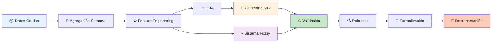
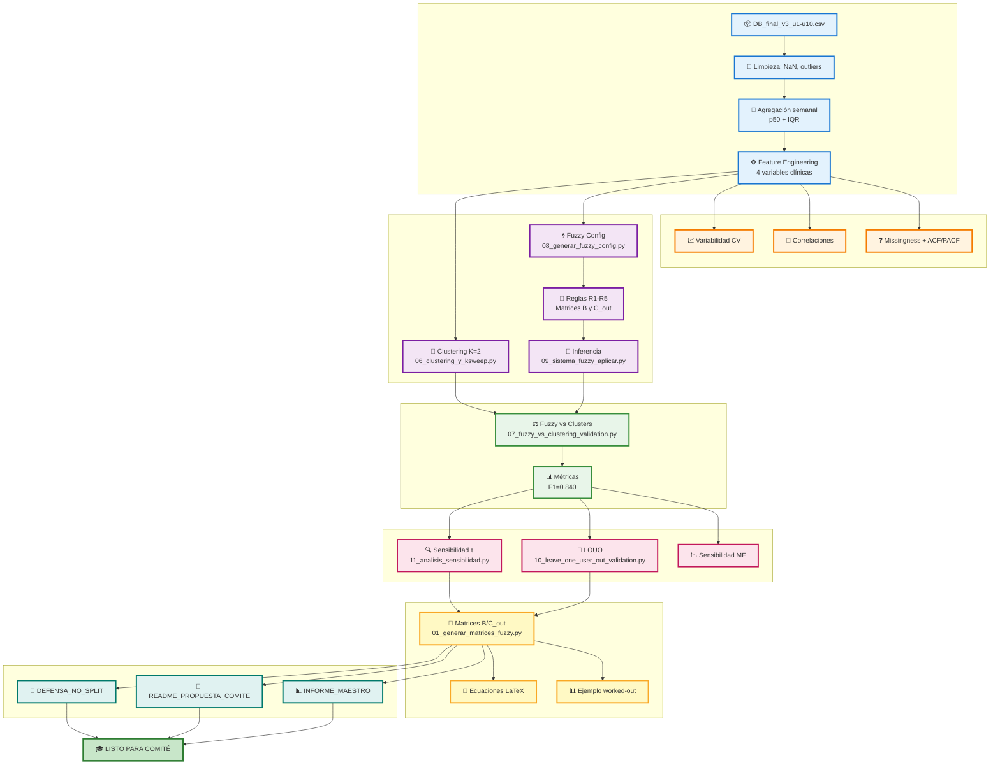
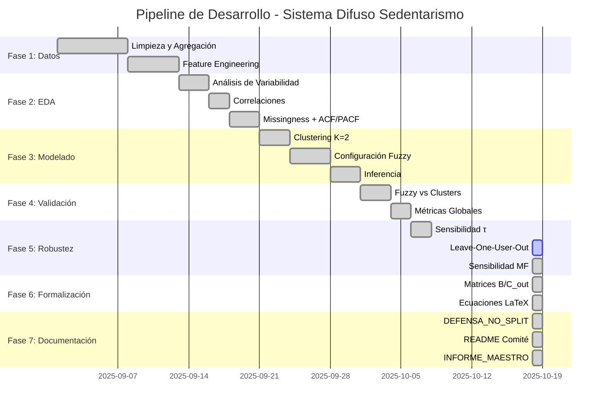
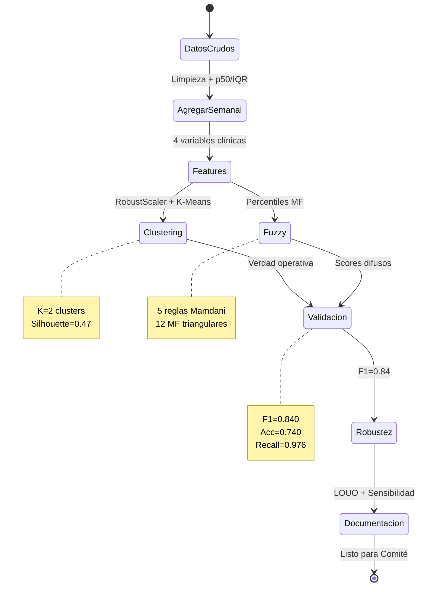
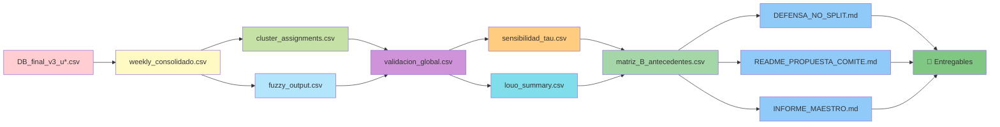
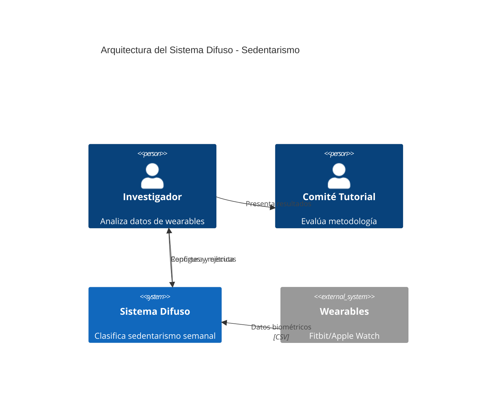
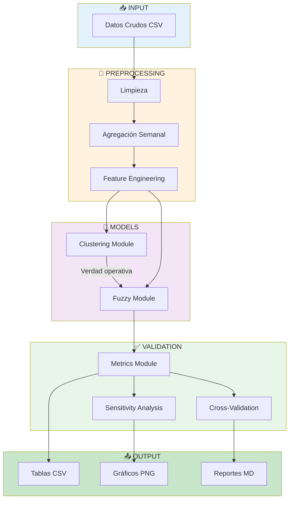

# 📊 DIAGRAMA DE FLUJO COMPLETO - SISTEMA DIFUSO SEDENTARISMO

## Versión Simplificada (Alto Nivel)



---

## Versión Detallada (Con Scripts)



---

## Versión con Timeline



---

## Versión Simplificada para Presentación



---

## Flujo de Datos (Archivos)



---

## Arquitectura del Sistema



---

## Diagrama de Componentes



---

## Cómo Visualizar estos Diagramas

### **Opción 1: En Cursor/VS Code**
1. Instalar extensión "Markdown Preview Mermaid Support"
2. Abrir este archivo `.md`
3. Presionar `Ctrl+Shift+V` (Preview)

### **Opción 2: Online**
1. Copiar el código Mermaid
2. Ir a https://mermaid.live/
3. Pegar y visualizar

### **Opción 3: Exportar como Imagen**
```bash
# Instalar mermaid-cli
npm install -g @mermaid-js/mermaid-cli

# Generar imagen
mmdc -i PIPELINE_MERMAID.md -o pipeline.png
```

---

**Fin del Documento**


