# 📊 DIAGRAMA DE FLUJO COMPLETO - SISTEMA DIFUSO SEDENTARISMO

## Versión Simplificada (Alto Nivel)

```mermaid
flowchart LR
    A[📦 Datos Crudos] --> B[📅 Agregación Semanal]
    B --> C[⚙️ Feature Engineering]
    C --> D[📊 EDA]
    D --> E[🎯 Clustering K=2]
    C --> F[🌀 Sistema Fuzzy]
    E --> G[⚖️ Validación]
    F --> G
    G --> H[🔍 Robustez]
    H --> I[📐 Formalización]
    I --> J[📄 Documentación]
    
    style A fill:#e3f2fd
    style E fill:#fff3e0
    style F fill:#f3e5f5
    style G fill:#c8e6c9
    style J fill:#ffccbc
```



---

## Versión Detallada (Con Scripts)

```mermaid
graph TB
    %% FASE 1: DATOS
    subgraph DATOS[" "]
        A1[📦 DB_final_v3_u1-u10.csv]
        A2[🧹 Limpieza: NaN, outliers]
        A3[📅 Agregación semanal<br/>p50 + IQR]
        A4[⚙️ Feature Engineering<br/>4 variables clínicas]
        
        A1 --> A2
        A2 --> A3
        A3 --> A4
    end
    
    %% FASE 2: EDA
    subgraph EDA[" "]
        B1[📈 Variabilidad CV]
        B2[🔗 Correlaciones]
        B3[❓ Missingness + ACF/PACF]
        
        A4 --> B1
        A4 --> B2
        A4 --> B3
    end
    
    %% FASE 3: MODELADO
    subgraph MODELADO[" "]
        C1[🎯 Clustering K=2<br/>06_clustering_y_ksweep.py]
        C2[🌀 Fuzzy Config<br/>08_generar_fuzzy_config.py]
        C3[📜 Reglas R1-R5<br/>Matrices B y C_out]
        C4[🔄 Inferencia<br/>09_sistema_fuzzy_aplicar.py]
        
        A4 --> C1
        A4 --> C2
        C2 --> C3
        C3 --> C4
    end
    
    %% FASE 4: VALIDACIÓN
    subgraph VALIDACION[" "]
        D1[⚖️ Fuzzy vs Clusters<br/>07_fuzzy_vs_clustering_validation.py]
        D2[📊 Métricas<br/>F1=0.840]
        
        C1 --> D1
        C4 --> D1
        D1 --> D2
    end
    
    %% FASE 5: ROBUSTEZ
    subgraph ROBUSTEZ[" "]
        E1[🔍 Sensibilidad τ<br/>11_analisis_sensibilidad.py]
        E2[👥 LOUO<br/>10_leave_one_user_out_validation.py]
        E3[📉 Sensibilidad MF]
        
        D2 --> E1
        D2 --> E2
        D2 --> E3
    end
    
    %% FASE 6: FORMALIZACIÓN
    subgraph FORMALIZACION[" "]
        F1[📐 Matrices B/C_out<br/>01_generar_matrices_fuzzy.py]
        F2[📄 Ecuaciones LaTeX]
        F3[📊 Ejemplo worked-out]
        
        E1 --> F1
        E2 --> F1
        F1 --> F2
        F1 --> F3
    end
    
    %% FASE 7: DOCUMENTACIÓN
    subgraph DOCS[" "]
        G1[📄 DEFENSA_NO_SPLIT]
        G2[📘 README_PROPUESTA_COMITE]
        G3[📊 INFORME_MAESTRO]
        
        F1 --> G1
        F1 --> G2
        F1 --> G3
    end
    
    %% ENTREGABLE FINAL
    H1[🎓 LISTO PARA COMITÉ]
    
    G1 --> H1
    G2 --> H1
    G3 --> H1
    
    %% ESTILOS
    classDef datosStyle fill:#e3f2fd,stroke:#1976d2,stroke-width:3px
    classDef edaStyle fill:#fff3e0,stroke:#f57c00,stroke-width:3px
    classDef modeloStyle fill:#f3e5f5,stroke:#7b1fa2,stroke-width:3px
    classDef validStyle fill:#e8f5e9,stroke:#388e3c,stroke-width:3px
    classDef robustezStyle fill:#fce4ec,stroke:#c2185b,stroke-width:3px
    classDef formalStyle fill:#fff9c4,stroke:#f9a825,stroke-width:3px
    classDef docsStyle fill:#e0f2f1,stroke:#00796b,stroke-width:3px
    classDef finalStyle fill:#c8e6c9,stroke:#2e7d32,stroke-width:4px
    
    class A1,A2,A3,A4 datosStyle
    class B1,B2,B3 edaStyle
    class C1,C2,C3,C4 modeloStyle
    class D1,D2 validStyle
    class E1,E2,E3 robustezStyle
    class F1,F2,F3 formalStyle
    class G1,G2,G3 docsStyle
    class H1 finalStyle
```



---

## Versión con Timeline


---

## Versión Simplificada para Presentación


---

## Flujo de Datos (Archivos)


---

## Arquitectura del Sistema


---

## Diagrama de Componentes

```mermaid
graph TB
    subgraph INPUT["📥 INPUT"]
        I1[Datos Crudos CSV]
    end
    
    subgraph PREPROCESSING["🔧 PREPROCESSING"]
        P1[Limpieza]
        P2[Agregación Semanal]
        P3[Feature Engineering]
        
        P1 --> P2
        P2 --> P3
    end
    
    subgraph MODELS["🤖 MODELS"]
        M1[Clustering Module]
        M2[Fuzzy Module]
        
        M1 --> |"Verdad operativa"| M2
    end
    
    subgraph VALIDATION["✅ VALIDATION"]
        V1[Metrics Module]
        V2[Sensitivity Analysis]
        V3[Cross-Validation]
        
        V1 --> V2
        V1 --> V3
    end
    
    subgraph OUTPUT["📤 OUTPUT"]
        O1[Tablas CSV]
        O2[Gráficos PNG]
        O3[Reportes MD]
    end
    
    I1 --> P1
    P3 --> M1
    P3 --> M2
    M2 --> V1
    V1 --> O1
    V2 --> O2
    V3 --> O3
    
    style INPUT fill:#e3f2fd
    style PREPROCESSING fill:#fff3e0
    style MODELS fill:#f3e5f5
    style VALIDATION fill:#e8f5e9
    style OUTPUT fill:#c8e6c9
```



---

## Cómo Visualizar estos Diagramas

### **Opción 1: En Cursor/VS Code**
1. Instalar extensión "Markdown Preview Mermaid Support"
2. Abrir este archivo `.md`
3. Presionar `Ctrl+Shift+V` (Preview)

### **Opción 2: Online**
1. Copiar el código Mermaid
2. Ir a https://mermaid.live/
3. Pegar y visualizar

### **Opción 3: Exportar como Imagen**
```bash
# Instalar mermaid-cli
npm install -g @mermaid-js/mermaid-cli

# Generar imagen
mmdc -i PIPELINE_MERMAID.md -o pipeline.png
```

---

**Fin del Documento**


